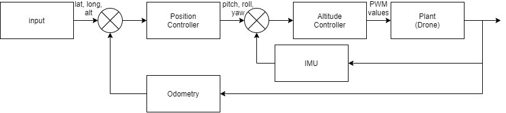

# PID based autonomous drone navigation
We have used PID based control systems for the proposed system in fig. 1. The basic idea of PID is error of the system will be estimated based on setpoint (SP) values and the process variable (PV) value estimated. Thus, weights will be assigned and subsequent PWM values will be generated based on mathematical models and resulting speed of the rotors will be passed to the motors. This is the crux part of PID control system in general. We are using two PID modules in this work namely Altitude Controller (AC) and Position Controller (PC).

## BASICS OF PID

Proportional Controller (P only)- Stabilizes unstable process. It helps in reducing the steady state error in the operation. But this controller can’t always eliminate the steady state error. Thus, we will check along with Derivative controller next.
output = Kp * error

Proportional Derivative Controller (PD only)- Increases the net stability of the operation. Derivative part of the control system helps in predicting the future errors of the systems based on its response. Thus, it helps in controlling the sudden shift of the operation.
output = Kp * error + Kd * (error - previous error)

Proportional-Integral-Derivative Controller (PID)- Thus, this is a very dynamic system equipped with zero state error, fast response, no oscillations and high stability. Here in equation 3, Iterm is incremented for every estimated error value in the system.
output = Kp*error + (Iterm + error) * Ki + Kd*(error - previous error)

## MY WORK

The Altitude Controller stabilizes the drone at the zero-error roll, yaw and pitch (R-P-Y) angles using a PID based control system. That’s, stabilizing the orientation of the drone (R-P-Y) using PID is the aim of altitude controller. Then tuning of the proportional, integral and derivative function has been done to get the best suitable controller configuration.

The Position Controller takes in the target coordinates as setpoint values and calculates the R-P-Y angles to successfully move to the setpoint coordinates. That’s position of the drone with respect to the environment is estimated using this controller. This controller will be in sequence with the altitude controller designed as mentioned in the previous paragraph.

These altitude and position controllers work in synchronization to autonomously navigate in the environment in a robust manner. From the fig. mentioned above, we can clearly understand the workflow, the position that’s the latitude, longitude and altitude is passed through the position controller as input and then the output of the position controller being the R-P-Y values (orientation) which will act as input of the altitude controller. Thus, a dynamic position controller was designed so that instantaneous change in the latitude, longitude and altitude (position) can be altered and navigation can be established accordingly.

## REFERENCES

[1]. https://www.youtube.com/watch?v=wkfEZmsQqiA&list=PLn8PRpmsu08pQBgjxYFXSsODEF3Jqmm-y
[2]. http://brettbeauregard.com/blog/2011/04/improving-the-beginners-pid-introduction/
